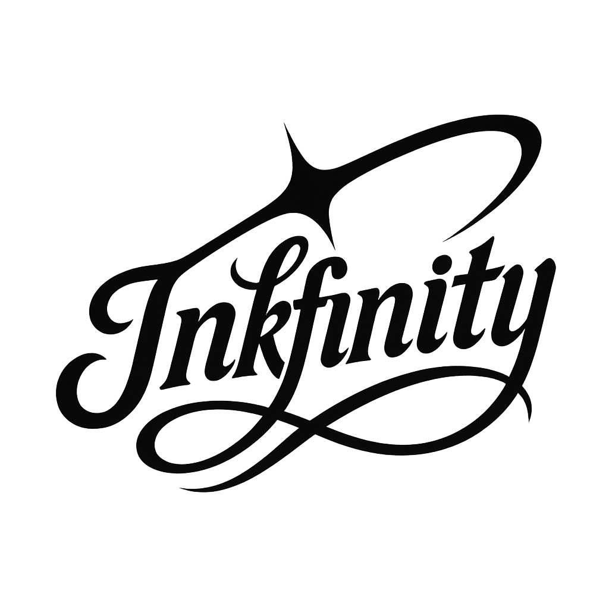

<div align="center">
  
  <h3>Transforming the tattoo industry through blockchain technology</h3>
</div>

<div align="center">
  <a href="#-vision"><strong>Vision</strong></a> ·
  <a href="#-quickstart"><strong>Quickstart</strong></a> ·
  <a href="#-tech-stack"><strong>Tech Stack</strong></a> ·
  <a href="#-development"><strong>Development</strong></a> ·
  <a href="#-contributing"><strong>Contributing</strong></a>
</div>

<br />

## 🔮 Vision

Inkfinity is a global blockchain platform designed to transform the tattoo industry by leveraging cutting-edge Web3 technologies. Our platform empowers tattoo artists, collectors (tattoo clients), and studios with a secure, transparent, and innovative ecosystem.

### Core Features

- **🎨 NFT Design Registry**: Authenticate original designs and elevate tattoo art into verifiable digital assets
- **📅 Smart Contract Bookings**: Solve no-shows and late cancellations with trustless scheduling
- **💸 Stablecoin Payments**: Eliminate currency volatility with instant, low-cost transactions
- **🔐 Privacy Protection**: Utilize zero-knowledge cryptography to maintain data integrity without sacrificing privacy
- **🌐 Global Community**: Connect artists and collectors worldwide through an authenticated platform

Built on StarkNet's Layer-2 network, Inkfinity combines blockchain's immutability, transparency, and global reach with features tailored specifically for the tattoo industry. We're not just digitizing existing processes—we're reimagining them to enhance trust, unlock new value, and strengthen the artist-client relationship.

## 🚀 Quickstart

### Prerequisites

Before you begin, you need to install the following tools:

- [Node.js (>= v18.17)](https://nodejs.org/en/download/)
- [Yarn](https://yarnpkg.com/getting-started/install)
- [Git](https://git-scm.com/downloads)

### Option 1: Local Development Setup

1. **Install Starknet development tools**

   ```bash
   curl --proto '=https' --tlsv1.2 -sSf https://sh.starkup.sh | sh
   ```

   This installs:
   - [Scarb](https://docs.swmansion.com/scarb/) - Cairo package manager
   - [Starknet Foundry](https://foundry-rs.github.io/starknet-foundry/) - Testing toolchain
   - [asdf](https://asdf-vm.com/) - Version manager
   - [Cairo VSCode extension](https://marketplace.visualstudio.com/items?itemName=starkware.cairo1)

2. **Clone the repository and install dependencies**

   ```bash
   git clone https://github.com/your-username/inkfinity-mvp.git
   cd inkfinity-mvp
   yarn install
   ```

3. **Install Starknet Devnet**

   ```bash
   asdf plugin add starknet-devnet
   asdf install
   ```

### Option 2: Docker Development Container

1. **Install Docker Desktop**
   
   Download and install [Docker Desktop](https://www.docker.com/get-started/)

2. **Install VS Code with Dev Containers extension**
   
   Install the [Dev Containers](https://marketplace.visualstudio.com/items?itemName=ms-vscode-remote.remote-containers) extension in Visual Studio Code

3. **Clone the repository**

   ```bash
   git clone https://github.com/your-username/inkfinity-mvp.git
   cd inkfinity-mvp
   ```

4. **Open in Container**
   
   Open the project in VS Code and select "Reopen in Container" when prompted

## 🏄‍♂️ Development Workflow

### Start Local Network

```bash
yarn chain
```

This starts a local Starknet network using Devnet for development and testing.

### Deploy Smart Contracts

```bash
yarn deploy
```

This deploys sample contracts to your local network.

### Start Frontend Application

```bash
yarn start
```

Visit your app at: `http://localhost:3000`

## 🧰 Tech Stack

- **Frontend**: Next.js, TailwindCSS, DaisyUI
- **Smart Contracts**: Cairo (StarkNet's native language)
- **Development Tools**: Scarb, Starknet Foundry, starknet-devnet
- **Blockchain**: StarkNet Layer-2 network
- **Payments**: USDC stablecoin integration

## 🧪 Testing

```bash
# Run smart contract tests
yarn test

# Run frontend tests
yarn test:nextjs
```

## 📦 Available Commands

| Command          | Description                                           |
|------------------|-------------------------------------------------------|
| `yarn chain`     | Start local Starknet network                          |
| `yarn compile`   | Compile smart contracts                               |
| `yarn deploy`    | Deploy contracts to network                           |
| `yarn start`     | Start frontend development server                     |
| `yarn test`      | Run smart contract tests                              |
| `yarn test:nextjs` | Run frontend tests                                  |

## 🤝 Contributing

We welcome contributions to Inkfinity! Before you start, please read our [Contribution Guide](docs/contribution-guide/README.md) and [Issue Application Template](docs/contribution-guide/issue-application-template.md) to understand our workflow and requirements.

### Contribution Process

1. **Read the documentation first**: Familiarize yourself with our [Contribution Guide](docs/contribution-guide/README.md) and [Design & Code Style Guide](docs/code-and-design-guide/code-and-design-guides.md)

2. **Find or create an issue**: Browse existing [issues](https://github.com/your-org/inkfinity-mvp/issues) or create a new one

3. **Apply to work on an issue**: Use our [Issue Application Template](docs/contribution-guide/issue-application-template.md) to express interest in working on an issue

4. Once approved:
   - Fork the repository
   - Create a new branch (`git checkout -b feature/amazing-feature`)
   - Make your changes following our coding standards
   - Commit your changes with signed commits (`git commit -S -m 'Add feature'`)
   - Push to your branch (`git push origin feature/amazing-feature`)
   - Open a Pull Request

5. **Code review process**: All PRs go through our automated (CodeRabbit AI) and human review processes

### Getting Help

Join our [Discord community](https://discord.gg/rNtxMz4uPG) or [Telegram Community](https://t.me/inkfinity) if you have questions or need assistance with your contribution.

## 📄 License

This project is licensed under the MIT License - see the [LICENSE](LICENSE) file for details.

---

<div align="center">
  <h3>Built with ❤️ by the Inkfinity Team</h3>
</div>
